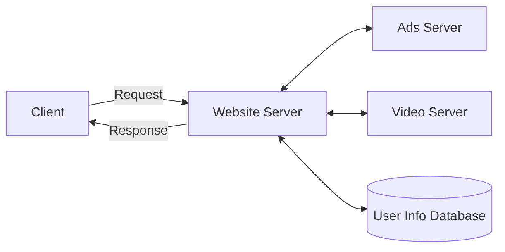
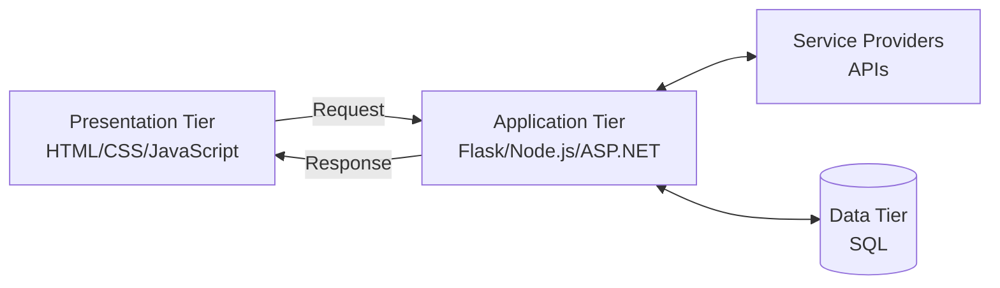

# HTML und die Grundlagen des Web

G-SEAI | 07 HTML/CSS


---

## Agenda

1. Ursprünge
2. HTTP und Client-Server-Systeme
3. Three-Tier Architecture

---

## Ursprünge


**HTML** steht für **HyperText Markup Language** und ist die Standard-Markup-Sprache, mit der Webseiten erstellt werden.

Eine Markup-Sprache ist eine Art, ein Dokument so zu gliedern, dass die Gliederung syntaktisch klar vom eigentlichen Inhalt unterscheidbar ist — sie **sagt dem Webbrowser, wie er den Content einer Seite darstellen soll**.


---

## Ursprünge


**HTML** entstand Ende der 1980er Jahre, nachdem [Tim Berners-Lee](https://www.w3.org/People/Berners-Lee/) ein **Hypertext-System beschrieb, das über das Internet funktionieren kann**.

Er merkte unter anderem an, dass sich damit eine Enzyklopädie modellieren ließe: **eine Reihe miteinander verbundener Dokumente, beschrieben durch einen einheitlichen, standardisierten Satz von Regeln**.

???

1989 CERN-Proposal, 1990 der erste Browser/Editor und Server. Der Kommentar seines Chefs Mike Sendall: "vague, but exciting".

---
## Ursprünge


**HTML** entstand Ende der 1980er Jahre, nachdem [Tim Berners-Lee](https://www.w3.org/People/Berners-Lee/) ein **Hypertext-System beschrieb, das über das Internet funktionieren kann**.

Er merkte unter anderem an, dass sich damit eine Enzyklopädie modellieren ließe: **eine Reihe miteinander verbundener Dokumente, beschrieben durch einen einheitlichen, standardisierten Satz von Regeln**.

???

1989 CERN-Proposal, 1990 der erste Browser/Editor und Server. Der Kommentar seines Chefs Mike Sendall: "vague, but exciting".

---

## Ursprünge

```html
<!doctype html>
<html>
  <head>
    <title>HTML</title>
  </head>
  <body>
    <h1>HTML</h1>
    <p>
      Mit HTML sagen wir dem Browser, wie ein
      Dokument im Web dargestellt werden soll.
    </p>
    <ul>
      <li>Es sagt dem Browser, wie der Content
        dargestellt wird</li>
      <li>Es hat eine Fülle nützlicher Elemente,
        um das Dokument zu beschreiben</li>
      <li>Zum Beispiel eine Möglichkeit, Listen
        zu erzeugen!</li>
    </ul>
  </body>
</html>
```

|||

### So rendert der Browser das

**HTML**

Mit HTML sagen wir dem Browser, wie ein Dokument im Web dargestellt werden soll.

- Es sagt dem Browser, wie der Content dargestellt wird
- Es hat eine Fülle nützlicher Element, um das Dokument zu beschreiben
- Zum Beispiel eine Möglichkeit, Listen zu erzeugen!


---

## HTTP und Client-Server-Systeme

- Weil **HTML** über das Internet ausgeliefert werden soll, brauchen wir einen Weg dafür: das **HyperText Transfer Protocol**, kurz **HTTP**. HTTP ist die Grundlage jedes Datenaustauschs im Web und das Protokoll zur Übertragung von Hypermedia-Dokumenten wie HTML, JSON, SVGs...

- HTTP folgt dem klassischen **Client-Server-Model**: ein **Client** — in unserem Fall das Gerät eines Users — schickt einen **Request** an einen entfernten **Server** und wartet auf die **Response**, die schließlich zurück an den Client geliefert wird.

---

## HTTP und Client-Server-Systeme


!caption[Ein klassisches Client-Server-Model]

???

Der Server ist selten allein: Er ist oft selbst wieder Client für andere Services.

---

## Three-Tier Architecture

Dieses Modell lässt sich zur sogenannten **Three-Tier Architecture** (Drei-Schichten-Architektur) zusammenfassen — eine Art, Anwendungen so zu denken, dass jeder Schicht ihre eigene Infrastruktur besitzt:

- Ein **Presentation Tier**, das User Interface.
- Ein **Application Tier**, die Logikschicht, in die der Programmkern gehört.
- Ein **Data Tier**, die Schicht, in der Daten gelesen, gespeichert und verändert werden.

---

## Three-Tier Architecture


!caption[Das ist die Three-Tier Architecture, auf die wir hinarbeiten]


---
