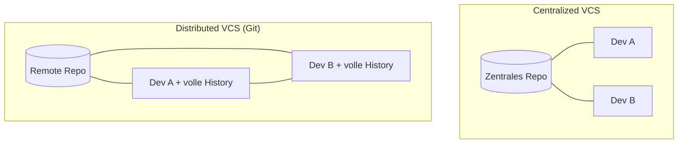
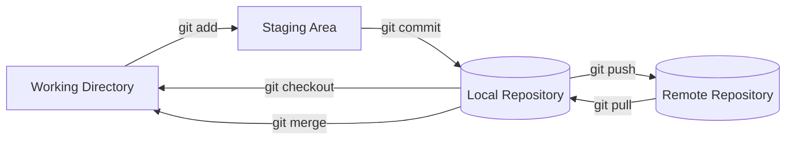
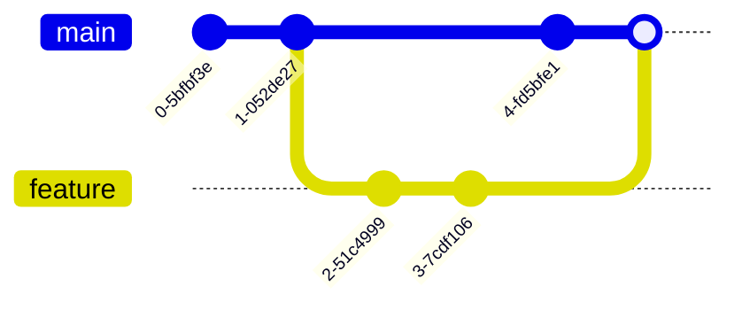
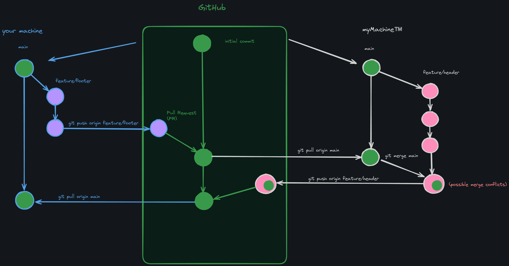

# Git: Version Control

G-SEAI | 02 Frontend

---

## Agenda

1. Die Ursprünge von Git
2. Was ist Git?
3. Was kann man mit Git machen?
4. Die zentralen Bereiche eines Git Repos
5. Grundlegende Git-Konzepte
6. Der Git Workflow

---

## Die Ursprünge von Git

Git wurde **2005** von **Linus Torvalds** entwickelt — dem Schöpfer des Betriebssystems **Linux**.

Das Ziel: ein Werkzeug, das mit **großen Projekten** wie dem Linux-Kernel umgehen kann — **schnell** und **effizient**.

???

Kontext: Der Linux-Kernel hatte damals tausende Contributors weltweit. Die bis dahin genutzte Software (BitKeeper) verlor ihre kostenlose Lizenz — Torvalds hat Git daraufhin in wenigen Wochen selbst geschrieben. Deshalb ist Git so auf Geschwindigkeit und verteiltes Arbeiten optimiert: es musste von Tag eins mit einem riesigen, weltweit verteilten Projekt klarkommen.

---

## Die Ursprünge von Git

.
.
.

 
Kurz nach der Entstehung übergab Torvalds die Wartung an **Junio Hamano**, der die Weiterentwicklung von Git bis heute betreut.

???

Fun Fact: Torvalds hat Git erfunden, aber sehr schnell losgelassen. Hamano ist seit 2005 Maintainer — eine der längsten durchgehenden Maintainer-Rollen in der Open-Source-Welt.

---

## Was ist Git?

Git ist ein **distributed version control system** (verteiltes Versionskontrollsystem).

- Mehrere Entwickler:innen arbeiten am selben Projekt, **ohne** permanent mit einem zentralen Server verbunden zu sein.
- **Jede:r hat die komplette History** des Projekts lokal — das macht Git robust gegen Datenverlust.
- Änderungen entstehen **lokal** und werden später über verschiedene Workflows in eine oder mehrere **Remote**-Versionen gemerged.

???

Der wichtigste praktische Vorteil: **Offline-Arbeiten ist möglich**. Committen, branchen, in der History stöbern — all das braucht kein Netzwerk. Nur `push` und `pull` reden mit dem Server.

Vertiefung für Interessierte: https://git-scm.com/book/en/v2/Distributed-Git-Distributed-Workflows

---

## Zentral vs. Distributed

???

Links: Es gibt genau **eine** Hauptkopie. Ist der Server weg, ist die History weg. Ohne Verbindung geht nichts.

Rechts: Jeder Klon ist ein vollwertiges Repository mit kompletter History. Das Remote ist nur ein vereinbarter Treffpunkt — technisch nichts Besonderes.

Frage an die Runde: Was passiert, wenn GitHub morgen offline geht? (Antwort: eure Arbeit ist immer noch da.)

---

## Was kann man mit Git machen?

Git verwaltet Änderungen an einem Projekt, **ohne** dass etwas überschrieben wird:

- Den Projektcode (Codebase) in einem **Repository** versammeln
- **Änderungen** an Dateien nachverfolgen
- Neue Features oder Fixes in eigenen **Branches** isolieren
- Bestimmte Momente mit einem **Commit** markieren
- Änderungen von einem Branch in einen anderen **mergen**

---

## Was kann man mit Git machen?

- Änderungen **verschiedener Entwickler:innen** reibungslos zusammenführen
- Ein oder mehrere **Remote Repositories** im Blick behalten
- Änderungen zu einem Remote **pushen**
- Änderungen von einem Remote **pullen**

???

Der rote Faden über alle Punkte: Git überschreibt nichts. Jeder Stand bleibt erreichbar. Das ist der Grund, warum man sich mit Git trauen kann, Dinge kaputt zu machen.

---

## Die zentralen Bereiche eines Git Repos

- **Working Directory**: euer lokales Verzeichnis auf dem Rechner, in dem ihr die Dateien tatsächlich bearbeitet.
- **Staging Area**: auch **Index** genannt. Hier sammelt ihr Änderungen aus dem Working Directory, bevor sie in die Projekt-History wandern.
- **Local Repository**: das Repository auf eurer Maschine, in dem Git alle Änderungen und die komplette History speichert.
- **Remote Repository**: typischerweise auf einem Server oder einer Plattform wie **GitHub** — dort wird der Code geteilt oder öffentlich abgelegt.

???

Die Staging Area ist der Teil, der Einsteiger:innen am meisten verwirrt. Analogie: Working Directory = Schreibtisch, Staging Area = der Stapel, den ihr bewusst in den Umschlag legt, Commit = Umschlag zukleben und ins Archiv stellen.

Wichtig zu betonen: Ein `commit` speichert **nur**, was vorher gestaged wurde — nicht alles, was ihr geändert habt.

---

## Die zentralen Bereiche eines Git Repos

???

Diese Grafik am Whiteboard mitzeichnen lassen — sie beantwortet 80 % aller späteren Fragen.

Beachtet: Die ersten drei Kästen sind **alle lokal**. Erst `git push` verlässt euren Rechner.

---

## Grundlegende Git-Konzepte

- **Repository**: die Datenbank mit History, Änderungen und Details eures Projekts.
- **Clone**: eine lokale Kopie eines Repositories anlegen, das remote existiert.
- **Branch**: eine unabhängige Entwicklungslinie. Ihr könnt beliebig viele gleichzeitig haben.
- **Staging**: Änderungen aus dem Working Directory in die Staging Area übernehmen, als Vorbereitung für den Commit.

---

## Grundlegende Git-Konzepte

- **Committing**: die gestageten Änderungen in die History des Local Repository schreiben.
- **Merge**: Änderungen eines Branches in einen anderen integrieren.
- **Pull**: Änderungen vom Remote holen **und** lokal mergen.
- **Push**: eure Commits vom Local Repository zum Remote schicken.

???

Merkhilfe: `pull` = `fetch` + `merge`. Das erklärt, warum ein `pull` Konflikte auslösen kann, ein `fetch` aber nie.

---

## Git Workflow

**1. Repository anlegen oder klonen**

Ein neues Projekt startet mit einem frisch erstellten Repository — oder mit dem Klon eines bestehenden von einem Remote-Server.

|||

**2. Branch erstellen**

Wenn ein neues Feature ansteht: einen neuen Branch anlegen und dort arbeiten.

???

In der Praxis: `git init` bzw. `git clone <url>`, danach `git switch -c feature/xyz`.

Frage in die Runde: Warum überhaupt branchen, wenn man alleine arbeitet? (Antwort: um einen funktionierenden `main` zu behalten, während man experimentiert.)

---

## Branching visuell

???

Zeigt schön: `main` läuft weiter, während `feature` unabhängig entsteht. Der Merge führt beide Linien wieder zusammen — nichts geht verloren, beide Historien bleiben sichtbar.

---

## Git Workflow

**3. Änderungen stagen**

Während ihr Dateien bearbeitet, fügt ihr diese Änderungen der Staging Area hinzu.

|||

**4. Änderungen committen**

Die gestageten Änderungen werden ins Local Repository committed. Jeder Commit ist ein **Snapshot** des Projekts zu einem bestimmten Zeitpunkt.

???

`git add <datei>` bzw. `git add .`, dann `git commit -m "..."`.

Betonen: "Snapshot", nicht "Diff" — Git speichert intern den kompletten Zustand, nicht nur die Unterschiede. Deshalb ist das Springen zwischen Commits so schnell.

Guter Zeitpunkt für die Regel: eine logische Änderung = ein Commit. Nicht "Arbeit von heute" = ein Commit.

---

## Git Workflow

**5. Mergen**

Regelmäßig Änderungen aus anderen Branches (z. B. `main`) übernehmen, damit euer Branch aktuell und kompatibel bleibt.

|||

**6. Pushen**

Sind die Änderungen getestet und fertig, wandern sie vom Local Repository ins Remote Repository.

???

"Regelmäßig mergen" ist der Punkt, den alle überspringen — und dann drei Wochen später einen riesigen Konflikt haben. Je öfter man merged, desto kleiner die Konflikte.

---

---

## Zusammenfassung

- Git ist ein **distributed** VCS — jede:r hat die volle History
- Vier Bereiche: **Working Directory → Staging Area → Local Repo → Remote Repo**
- Der Workflow: **clone → branch → add → commit → push → pull request**
- Git überschreibt nichts — jeder Stand bleibt erreichbar

---
